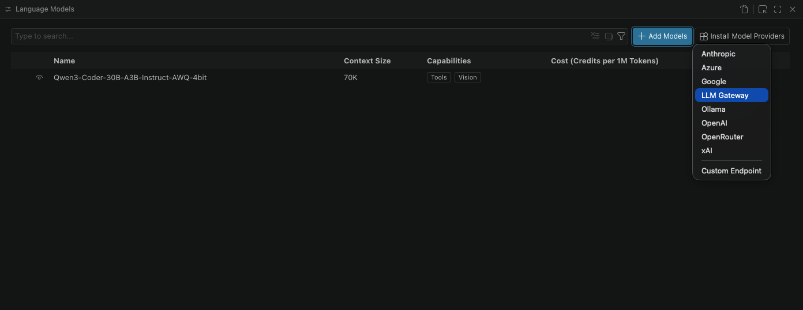
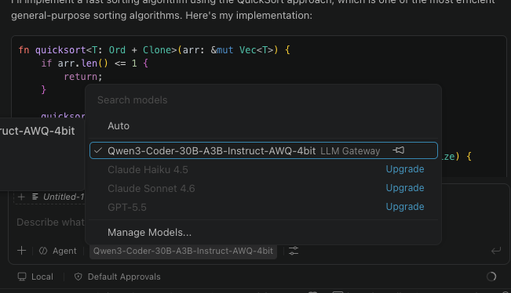
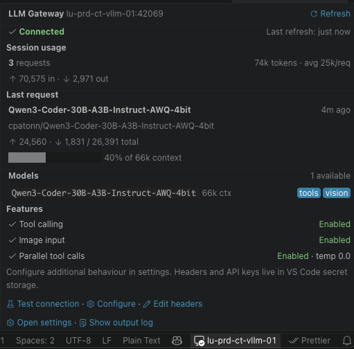

# GitHub Copilot LLM Gateway


[](https://github.com/arbs-io/github-copilot-llm-gateway/issues)


[](https://sonarcloud.io/summary/new_code?id=arbs-io_github-copilot-llm-gateway)
[](https://sonarcloud.io/summary/new_code?id=arbs-io_github-copilot-llm-gateway)
[](https://sonarcloud.io/summary/new_code?id=arbs-io_github-copilot-llm-gateway)
[](https://sonarcloud.io/summary/new_code?id=arbs-io_github-copilot-llm-gateway)
[](https://sonarcloud.io/summary/new_code?id=arbs-io_github-copilot-llm-gateway)

A robustness layer for running **self-hosted open-source models** inside GitHub Copilot Chat — built for the models and servers that don't _quite_ behave.

## Do I need this, or is native BYOK enough?

Since **VS Code 1.122**, VS Code ships a built-in **BYOK "Custom Endpoint" provider** (Generally Available) that connects any OpenAI-compatible server — vLLM, Ollama, llama.cpp, LM Studio, LocalAI — directly to Copilot chat, agent mode, tools, and MCP, with **no extension and no GitHub sign-in required**. For most setups that's the simplest path, and you should start there: run **Chat: Manage Language Models** from the Command Palette and add a Custom Endpoint.

**This extension is for the harder cases native BYOK doesn't handle.** Native BYOK trusts your endpoint as-is and does no quirk-smoothing — its own docs note that tool-call reliability "depends on your server's tool-call parser." When you're stuck with a specific small or quantized model, or a server you can't reconfigure, that's where this extension earns its place:

| Use **native BYOK** (built in) when…                                       | Use **this extension** when…                                                       |
| -------------------------------------------------------------------------- | ---------------------------------------------------------------------------------- |
| Your model + server are well-behaved                                       | Tool calls fail with malformed / truncated JSON                                    |
| You can pick the model and configure the server (e.g. `--tool-call-parser`) | You're locked to a specific small / quantized model that emits sloppy tool calls   |
| You want the simplest, first-party path                                    | Reasoning models leak `<think>` blocks into chat or burn their budget mid-thought  |
| You want cloud providers too (Anthropic, OpenAI, Gemini…)                  | You hit context-length errors and want safe, automatic token budgeting             |

If native BYOK already works well for you, you don't need this extension. If your self-hosted small models keep tripping over tool calling, reasoning tags, or context limits, read on.

## About

**GitHub Copilot LLM Gateway** registers as a language model provider inside GitHub Copilot Chat and adds a **resilience layer** for self-hosted open-source models served over any OpenAI-compatible API (vLLM, Ollama, llama.cpp, LM Studio, LocalAI). Models like Qwen, Llama, and Mistral appear in the Copilot model picker alongside the defaults — but unlike a plain passthrough, the gateway actively repairs the rough edges that small and quantized models produce.

### What it does that a plain connection doesn't

| Capability                   | What it solves                                                                                                                                                                                                                                            |
| ---------------------------- | -------------------------------------------------------------------------------------------------------------------------------------------------------------------------------------------------------------------------------------------------------- |
| **Tool-call JSON repair**    | Recovers truncated / malformed tool-call arguments (unclosed strings or braces, trailing commas) instead of aborting the call, and fills in missing _required_ arguments from the tool schema so the call still runs.                                      |
| **Streaming tool-call assembly** | Reassembles tool calls from incremental stream deltas across multiple wire formats, tolerating late or missing call IDs.                                                                                                                              |
| **Reasoning / thinking handling** | Routes `<think>`/`<thinking>` blocks (and a separate `reasoning_content` field) into Copilot's thinking UI instead of dumping chain-of-thought into the chat — handling tags split across stream chunks and LM Studio's stray-tag quirk, with a fallback when a model exhausts its budget mid-thought. |
| **Safe context budgeting**   | Auto-detects the real context window from `/v1/models` (across vLLM, Ollama, llama.cpp, and LocalAI field names) and shrinks `max_tokens` conservatively so small servers don't return context-length errors.                                            |
| **Tool-call tuning**         | Sends a low agent temperature and exposes parallel-tool-call / tool-choice toggles to stabilize tool-call formatting from finicky fine-tuned models.                                                                                                      |
| **Actionable diagnostics**   | Turns raw connection / auth / timeout and tool-parser failures into concrete fixes (remove a stray `/v1`, drop a `Bearer ` prefix, raise the timeout, disable tool calling).                                                                              |

It also keeps the familiar benefits of self-hosting: inference stays on your network, there are no per-token fees, and your self-hosted models don't draw down Copilot premium quota.

> **Privacy note**: This extension routes **LLM inference to your configured server only** — those requests never touch GitHub. It runs inside GitHub Copilot Chat, which is the host application and performs its own network activity (such as telemetry) that this extension cannot intercept or block. Some host features that default to GitHub — including conversation-title generation — can be redirected to a gateway model via VS Code's `chat.utilityModel` setting. See [Privacy & Network Requests](#privacy--network-requests) for details.

### Compatible Inference Servers

- [vLLM](https://github.com/vllm-project/vllm) — High-performance inference (recommended)
- [Ollama](https://ollama.ai/) — Easy local deployment
- [llama.cpp](https://github.com/ggml-org/llama.cpp) — CPU and GPU inference
- [Text Generation Inference](https://github.com/huggingface/text-generation-inference) — Hugging Face's server
- [LocalAI](https://localai.io/) — OpenAI API drop-in replacement
- Any OpenAI Chat Completions API-compatible endpoint

## Getting Started

> **Tip**: If you only need to connect a well-behaved model, [native BYOK](#do-i-need-this-or-is-native-byok-enough) is the simpler path. Install this extension when you want the robustness layer for misbehaving small models.

### Prerequisites

- **VS Code** 1.125.0 or later
- **GitHub Copilot** extension installed and signed in
- **Inference server** running with an OpenAI-compatible API

### Step 1: Install the Extension

Install **GitHub Copilot LLM Gateway** from the VS Code Marketplace.

<!-- Screenshot: Extension in marketplace -->

### Step 2: Start Your Inference Server

Launch your inference server with tool calling enabled. Here's an example using vLLM:

```bash
vllm serve Qwen/Qwen3-8B \
    --enable-auto-tool-choice \
    --tool-call-parser hermes \
    --max-model-len 32768 \
    --gpu-memory-utilization 0.95 \
    --host 0.0.0.0 \
    --port 42069
```

Verify the server is running:

```bash
curl http://localhost:42069/v1/models
```

### Step 3: Configure the Extension

1. Open VS Code **Settings** (`Ctrl+,` / `Cmd+,`)
2. Search for **"Copilot LLM Gateway"**
3. Set **Server URL** to your inference server address (e.g., `http://localhost:42069` to match the server started above; the setting defaults to `http://localhost:8000`)
4. Configure other settings as needed (token limits, tool calling, etc.)


> **Note**: If the server is unreachable, you'll see an error notification with a quick link to settings:
>
> 

### Step 4: Select Your Model in Copilot Chat

1. Open **GitHub Copilot Chat** (`Ctrl+Alt+I` / `Cmd+Alt+I`)
2. Click the **model selector** dropdown at the bottom of the chat panel
3. Click **"Manage Models..."** to open the model manager



4. Select **"LLM Gateway"** from the provider list
5. Enable the models you want to use from your inference server



### Step 5: Start Chatting

Your self-hosted models now appear alongside the default Copilot models. Select one and start coding with AI assistance!


The model integrates seamlessly with Copilot's features including:
- **Agent mode** for autonomous coding tasks
- **Tool calling** for file operations, terminal commands, and more
- **Context awareness** with `@workspace` and file references

### Status Bar & Connection Info

A status-bar entry (bottom-right) shows the gateway's connection state at a glance and turns into a live indicator while a request streams. Hover it for a detailed info popup — connection status, the detected models with their context windows and capabilities, running session token totals, the last request, and the active feature toggles. Click it to refresh the model list.



### Using your models in the Agents window (Preview)

VS Code 1.120+ adds the **Agents window** — a separate window for running multiple
agent sessions in parallel. The Agents window and Chat view share the same model
registry, so the gateway's models can be selected as a session's language model there
too.

Because the Agents window runs in its own window, extensions that execute code (like
this one) don't activate there automatically — VS Code only auto-activates extensions
that contribute purely static content (themes, grammars, keybindings). You opt this
extension in with the `extensions.supportAgentsWindow` setting:

```jsonc
"extensions.supportAgentsWindow": {
  "AndrewButson.github-copilot-llm-gateway": true
}
```

Requirements and notes:

1. The extension must be installed in your **default VS Code profile**.
2. After adding the setting, reload/reopen the Agents window so the extension activates.
3. Your gateway models then appear in the per-session **language model** picker, with the
   same tool-calling and image capabilities they have in Copilot Chat.

> Agents-window extension support is still a VS Code preview and is evolving. If a
> gateway model doesn't appear after opting in, confirm the extension is enabled in your
> default profile and check the **"GitHub Copilot LLM Gateway"** output channel.

## Configuration

Configure the extension through VS Code Settings (`Ctrl+,` / `Cmd+,`) → search "Copilot LLM Gateway".

### Connection Settings

| Setting             | Default                 | Description                                         |
| ------------------- | ----------------------- | --------------------------------------------------- |
| **Server URL**      | `http://localhost:8000` | Base URL of your OpenAI-compatible inference server |
| **API Key**         | _(empty)_               | Authentication key if your server requires one      |
| **Request Timeout** | `60000`                 | Request timeout in milliseconds                     |

### Model Settings

| Setting                       | Default  | Description                                                                                                  |
| ----------------------------- | -------- | ------------------------------------------------------------------------------------------------------------ |
| **Default Max Tokens**        | `262144` | Fallback context window size (input tokens) used only when the inference server does not report one itself.  |
| **Default Max Output Tokens** | `4096`   | Fallback maximum output tokens used only when the server does not report a context size.                     |
| **Model Context Windows**     | `{}`     | Per-model context window override (total tokens), keyed by model id or `*` wildcard. Wins over server-reported values. |
| **Enable Image Input**        | `true`   | Advertise image-input capability for multimodal models and forward image parts as base64 `image_url`s.       |

#### How the context window is determined

For each model the gateway uses, in priority order:

1. **Your `modelContextWindows` override**, if one matches the model id (exactly or via a `*` wildcard — same matching rules as `perModelOptions`).
2. **What the server reports** in `/v1/models`: `max_model_len` (vLLM, LiteLLM), `context_length` (Ollama, LocalAI, LM Studio), `context_window`, or llama.cpp's `meta.n_ctx` / `meta.n_ctx_train`.
3. **`defaultMaxTokens`** as the last resort.

Some servers can't report a size up-front — llama-server in **router mode**, for example, only includes context metadata for models that are currently loaded. If a request then overflows, the gateway parses the server's context-overflow error, learns the real limit for that model, and transparently retries the request once (when nothing has been streamed yet). Learned limits last for the session; add the model to `modelContextWindows` to persist them:

```jsonc
{
  "github.copilot.llm-gateway.modelContextWindows": {
    "qwen2.5-coder-32b": 32768, // exact model id
    "llama*": 123904 // wildcard family match
  }
}
```

### Advanced Model Parameters

Two settings let you pass extra sampling parameters straight through to the chat-completions request body. This is useful when your endpoint expects parameters like `temperature`, `top_p`, `top_k`, or `repetition_penalty` from the caller rather than configuring them server-side. Both are edited in `settings.json`.

| Setting                | Default | Description                                                                                  |
| ---------------------- | ------- | -------------------------------------------------------------------------------------------- |
| **Extra Model Options**| `{}`    | Parameters merged into every chat-completions request, regardless of which model is active.  |
| **Per Model Options**  | `{}`    | Parameters scoped to specific models, keyed by model id (with optional `*` wildcards).       |

Different model families often need different sampling parameters for the same task, so a single flat `extraModelOptions` set rarely fits every model you switch between. `perModelOptions` lets you pin parameters per model. Keys match the model id **exactly**, or use a `*` wildcard to cover a whole family (case-insensitive). When several keys match, an exact-id entry wins over a wildcard entry.

```jsonc
{
  // Applied to every model:
  "github.copilot.llm-gateway.extraModelOptions": {
    "repetition_penalty": 1.05
  },
  // Applied only to matching models (overrides extraModelOptions on conflict):
  "github.copilot.llm-gateway.perModelOptions": {
    "qwen*": { "temperature": 0.7, "top_p": 0.8, "top_k": 20 },
    "deepseek-r1": { "temperature": 0.6 }
  }
}
```

The merge order, lowest to highest priority, is: `extraModelOptions` → matching `perModelOptions` → per-request options supplied by Copilot itself.

### Tool Calling Settings

These settings control how the extension handles agentic features like code editing and file operations.

| Setting                   | Default | Description                                                                                            |
| ------------------------- | ------- | ------------------------------------------------------------------------------------------------------ |
| **Enable Tool Calling**   | `true`  | Allow models to use Copilot's tools (file read/write, terminal, etc.)                                  |
| **Parallel Tool Calling** | `true`  | Allow multiple tools to be called simultaneously. Disable if your model struggles with parallel calls. |
| **Agent Temperature**     | `0.0`   | Temperature for tool calling mode. Lower values produce more consistent tool call formatting.          |

> **Tip**: If your model outputs tool descriptions as text instead of actually calling tools, try setting **Agent Temperature** to `0.0` and disabling **Parallel Tool Calling**.

### Diagnostic Settings

| Setting              | Default | Description                                                                                                                                        |
| -------------------- | ------- | -------------------------------------------------------------------------------------------------------------------------------------------------- |
| **Verbose Logging**  | `false` | When enabled, the full request body (including messages and tool args) is written to the output channel. Keep disabled unless debugging an issue. |

### Inline Completions (Experimental)

VS Code does **not** let bring-your-own-key models power its own inline ("ghost text") code suggestions — that path still requires GitHub Copilot ([microsoft/vscode#318545](https://github.com/microsoft/vscode/issues/318545)). To fill the gap, this extension can provide its **own** inline completions straight from your inference server's `/v1/completions` endpoint, running *alongside* Copilot rather than through it.

| Setting                          | Default | Description                                                                                                       |
| -------------------------------- | ------- | ----------------------------------------------------------------------------------------------------------------- |
| **Enable Inline Completion**     | `false` | Turn on server-backed ghost-text completions.                                                                     |
| **Inline Completion Model**      | `""`    | Model id to use. Blank = the first model the server reports. Prefer a small fill-in-the-middle / base model.       |
| **Inline Completion Max Tokens** | `256`   | Maximum tokens generated per completion. Lower is faster.                                                          |
| **Inline Completion Debounce**   | `300`   | Milliseconds to wait after the last keystroke before requesting a completion.                                     |
| **Inline Completion Timeout**    | `3000`  | Per-request timeout (ms). Kept short so a slow server doesn't stall suggestions.                                   |

**Requirements & notes:**

- For true **fill-in-the-middle (FIM)**, your server must support the `/v1/completions` `suffix` parameter (llama.cpp, LM Studio, and most local servers do). The text before the cursor is sent as `prompt` and the text after as `suffix`.
- Servers that reject the `suffix` parameter — notably **vLLM**, which answers `400 "suffix is not currently supported"` — are detected automatically: the extension falls back to **prefix-only** completions (plain continuation of the code before the cursor) for the rest of the session. Completions still work, but the model can't see the code after the cursor.
- Point **Inline Completion Model** at a code/FIM or `*-base` model for best results — chat-tuned models tend to be slower and chattier for raw completion.
- If you already use GitHub Copilot's inline suggestions, leave this **off** to avoid two providers competing for the same ghost text.
- Completions are best-effort: server errors or timeouts simply yield no suggestion (details go to the output channel) rather than interrupting you.

### Using Gateway Models for Titles & Other Utility Tasks

VS Code uses small background models for "utility" work — chat **title generation**, commit messages, rename/branch-name suggestions, settings search, and Git review. By default these use GitHub Copilot's built-in utility models, which are unavailable if you run BYOK without signing into GitHub.

You can point them at one of your Gateway models instead, via VS Code's own settings (no extension configuration needed):

- `chat.utilityModel` — titles, summaries, settings search, Git review
- `chat.utilitySmallModel` — commit messages, rename and branch-name suggestions

Open **Settings**, search for `chat.utilityModel` / `chat.utilitySmallModel`, and pick your Gateway model from the dropdown (its `LLM Gateway` models appear there once the server is connected). When running BYOK without GitHub sign-in, VS Code also shows a prompt in the Chat view to configure these.

## Recommended Models

These models have been tested with good tool calling support:

| Model                                | VRAM  | Tool Support | Best For                  |
| ------------------------------------ | ----- | ------------ | ------------------------- |
| **Qwen/Qwen3-8B**                    | ~16GB | Excellent    | General coding, 32GB GPU  |
| **Qwen/Qwen2.5-7B-Instruct**         | ~14GB | Excellent    | Balanced performance      |
| **Qwen/Qwen2.5-14B-Instruct**        | ~28GB | Excellent    | Higher quality (48GB GPU) |
| **meta-llama/Llama-3.1-8B-Instruct** | ~16GB | Good         | Alternative to Qwen       |

> **Important**: Avoid **Qwen2.5-Coder** models for tool calling—they have [known issues](https://github.com/vllm-project/vllm/issues/10952) with vLLM's tool parser. Use standard Qwen2.5-Instruct or Qwen3 models instead.

## vLLM Setup Reference

### Installation

```bash
pip install vllm
```

### Tool Call Parsers

Each model family requires a specific parser:

| Model Family   | Parser        | Example                          |
| -------------- | ------------- | -------------------------------- |
| Qwen2.5, Qwen3 | `hermes`      | `--tool-call-parser hermes`      |
| Qwen3-Coder    | `qwen3_coder` | `--tool-call-parser qwen3_coder` |
| Llama 3.1/3.2  | `llama3_json` | `--tool-call-parser llama3_json` |
| Mistral        | `mistral`     | `--tool-call-parser mistral`     |

### VRAM Requirements

Approximate memory for BF16 (full precision) inference:

| Model Size | Model VRAM | 32K Context Total     |
| ---------- | ---------- | --------------------- |
| 7-8B       | ~16GB      | ~22GB                 |
| 14B        | ~28GB      | ~34GB                 |
| 30B+       | ~60GB      | Requires quantization |

### Example Server Commands

**Qwen3-8B** (Recommended):

```bash
vllm serve Qwen/Qwen3-8B \
    --enable-auto-tool-choice \
    --tool-call-parser hermes \
    --max-model-len 32768 \
    --gpu-memory-utilization 0.95 \
    --host 0.0.0.0 \
    --port 42069
```

**Llama 3.1 8B**:

```bash
vllm serve meta-llama/Llama-3.1-8B-Instruct \
    --enable-auto-tool-choice \
    --tool-call-parser llama3_json \
    --max-model-len 32768 \
    --host 0.0.0.0 \
    --port 42069
```

**Quantized Model** (limited VRAM):

```bash
vllm serve Qwen/Qwen2.5-14B-Instruct-AWQ \
    --enable-auto-tool-choice \
    --tool-call-parser hermes \
    --max-model-len 16384 \
    --gpu-memory-utilization 0.95 \
    --host 0.0.0.0 \
    --port 42069
```

## Troubleshooting

### Model not appearing in Copilot

1. Verify server is running: `curl http://your-server:port/v1/models`
2. Check **Server URL** in settings — paste the **base URL only**, e.g. `http://your-server:port`. Do **not** include a trailing `/v1` or a trailing slash; the extension appends `/v1/models` itself.
3. Check **API Key** — paste the key only. Do **not** prefix it with `Bearer `; the extension adds that automatically.
4. Run command **"GitHub Copilot LLM Gateway: Test Server Connection"** from the Command Palette.
5. If the connection worked earlier but models vanished, run **"GitHub Copilot LLM Gateway: Refresh Models"** from the Command Palette (or click the status-bar entry).
6. Inspect the **"GitHub Copilot LLM Gateway"** output channel for the exact URL being probed and the server's response.

### Model not appearing in the Agents window

The Agents window is a separate window and won't activate this extension automatically.

1. Add the opt-in setting (see [Using your models in the Agents window](#using-your-models-in-the-agents-window-preview)):
   `"extensions.supportAgentsWindow": { "AndrewButson.github-copilot-llm-gateway": true }`
2. Confirm the extension is installed in your **default VS Code profile**.
3. Reload/reopen the Agents window, then re-check the session's language model picker.

### "Model returned empty response"

The model failed to generate output. Try:

1. **Check tool parser** — Ensure `--tool-call-parser` matches your model family
2. **Disable tool calling** — Set `github.copilot.llm-gateway.enableToolCalling` to `false` to test basic chat
3. **Reduce context** — Your conversation may exceed the model's limit

### Tools described but not executed

The model outputs text like "Using the read_file tool..." instead of actually calling tools.

1. Use **Qwen3-8B** or **Qwen2.5-7B-Instruct** (avoid Coder variants)
2. Set **Agent Temperature** to `0.0`
3. Disable **Parallel Tool Calling**
4. Ensure server has `--enable-auto-tool-choice` flag

### Out of memory errors

- Reduce `--max-model-len` (try 8192 or 16384)
- Use a quantized model (AWQ, GPTQ, FP8)
- Choose a smaller model

## Commands

Access from the Command Palette (`Ctrl+Shift+P` / `Cmd+Shift+P`):

| Command                                                | Description                                                          |
| ------------------------------------------------------ | ------------------------------------------------------------------- |
| **GitHub Copilot LLM Gateway: Configure Server**       | Set the server URL and API key (also opened from "Add Models…")     |
| **GitHub Copilot LLM Gateway: Test Server Connection** | Test connectivity and list available models                         |
| **GitHub Copilot LLM Gateway: Refresh Models**         | Re-probe the inference server and refresh the picker                |
| **GitHub Copilot LLM Gateway: Edit Custom Headers**    | Add, edit, or remove custom HTTP headers (stored in secret storage) |
| **GitHub Copilot LLM Gateway: Show Output Log**        | Open the extension's output channel                                 |

## Privacy & Network Requests

This extension is a **Language Model provider** — it registers alongside GitHub's built-in models and handles inference when you select an LLM Gateway model. Understanding what it does and does not control is important:

### What this extension controls

- **Chat inference** — When you select an LLM Gateway model, all prompts, code snippets, and tool calls are sent exclusively to your configured server. None of this traffic touches GitHub.

### What this extension does NOT control

GitHub Copilot Chat is the host application. It performs its own network activity that this extension cannot intercept:

| Request | Why it happens | What is sent |
| --- | --- | --- |
| **GitHub authentication** | Copilot Chat requires a GitHub sign-in to activate, even for third-party model providers | OAuth tokens |
| **Conversation title generation** | By default Copilot Chat sends your first message to GitHub's API to auto-generate a title — redirectable to a gateway model via `chat.utilityModel` | Your prompt text |
| **Telemetry** | Copilot collects usage telemetry per its own policies | Usage metadata |

### Reducing exposure

While you cannot fully eliminate GitHub network requests when using Copilot Chat, you can minimise them:

- Set `chat.utilityModel` (and `chat.utilitySmallModel`) to a gateway model so conversation titles, commit messages, and other utility prompts are sent to your server instead of GitHub — see [Using Gateway Models for Titles & Other Utility Tasks](#using-gateway-models-for-titles--other-utility-tasks).
- Set `"telemetry.telemetryLevel": "off"` in VS Code settings to reduce VS Code/Copilot telemetry.

> **Note**: We have no control over the Copilot Chat host extension's core behaviour (auth, telemetry). The good news is
> that **VS Code 1.122 made BYOK work without a GitHub sign-in** — the native Custom Endpoint provider
> can run chat, tools, and MCP fully air-gapped, so if strict network isolation is your priority that
> path is worth evaluating. Utility tasks that used to be hardcoded to GitHub — including conversation
> title generation — can now be routed to your own model via the `chat.utilityModel` /
> `chat.utilitySmallModel` settings, keeping that text on your server too.

## Support

- **Issues & Feature Requests**: [GitHub Issues](https://github.com/arbs-io/github-copilot-llm-gateway/issues)
- **Discussions**: [GitHub Discussions](https://github.com/arbs-io/github-copilot-llm-gateway/discussions)

## License

MIT License — see [LICENSE](LICENSE) for details.

---

_This extension is not affiliated with GitHub or Microsoft. GitHub Copilot is a trademark of GitHub, Inc._
